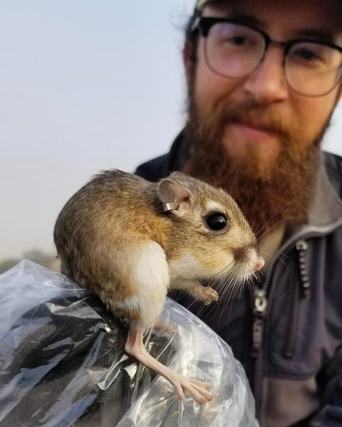

## **Research Interests**

My main area of interest is in how current and past human activity influence the behavior, ecology, and conservation of wildlife, particularly small mammals. Understanding how animals respond to disturbance is critical as anthropogenic disturbances continue to expand. My goal is to use applied research to help better inform management, conservation, and restoration efforts. I'm a currently pursuing my PhD in the [Natural Resources and the Environment](https://colsa.unh.edu/natural-resources-environment) department at the [University of New Hampshire](https://www.unh.edu/) with [Dr. Rebecca Rowe](https://colsa.unh.edu/person/rebecca-rowe).

 

I finished my BS in biology at [California Polytechnic State University, San Luis Obispo](https://www.calpoly.edu/) in 2014 and my MS in biology at the same university in 2020 with [Dr. Clint Francis](https://bio.calpoly.edu/content/clinton-francis).

