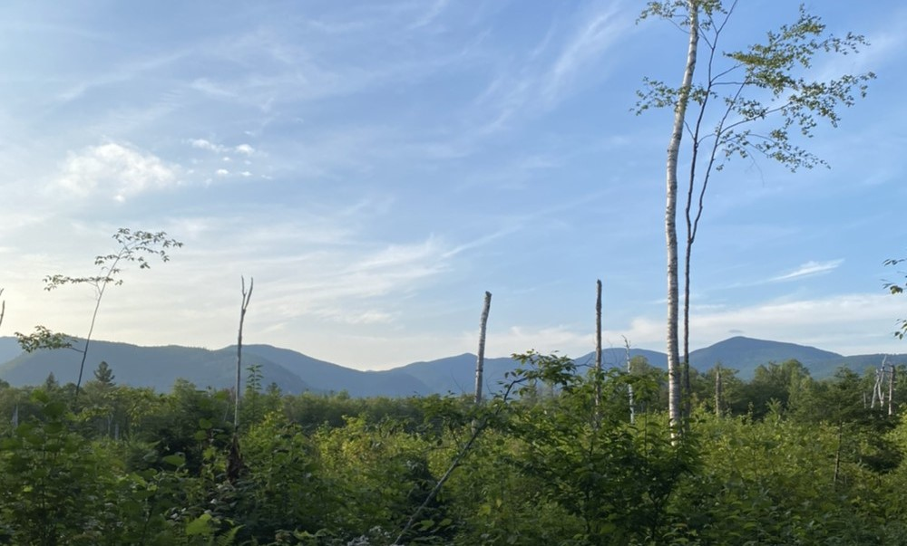
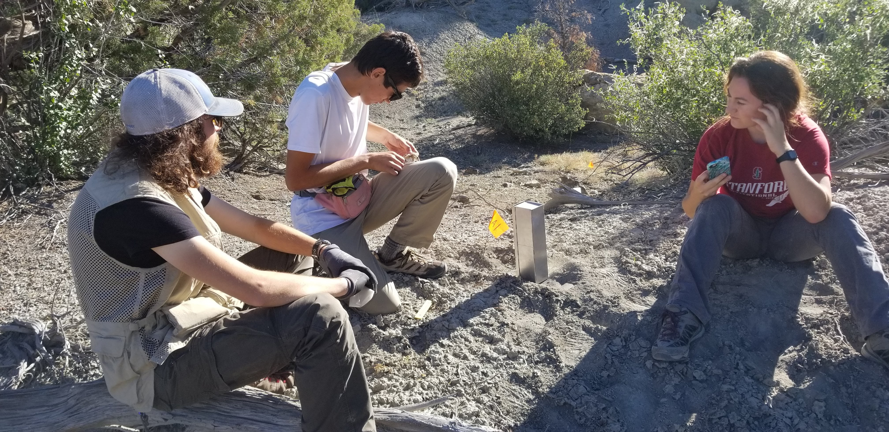

## **Forest Structure, Resource Availability, and Population Dynamics**

Timber harvest has historically been one of the largest disturbances to forest ecosystems in North America. Many different harvest approaches, such as clearcuts, partial harvest, and shelterwood harvest, have been utilized to allow for both economically feasible lumber harvest and the maintenance of natural ecosystems. Understanding how communities respond to these disturbances, and if there is any difference between harvest types, is critical for management efforts. My research will focus on long-term effects of different forest management strategies as well as the role that annual variation in resources, particularly beech mast, plays in population fluctuations and changes in community dynamics. To do this, I will use a combination of a long-term, 29-year data set from the USFS tracking small mammal communities at the Bartlett Experimental Forest in central New Hampshire alongisde a 10-year mark-recapture study in the same area. I will also be examining how annual variation in resource availability and snow pack influences small mammal population and community dynamics.

 
 

## **Light and Noise Pollution**
Typically when we talk about pollution the first things that come to mind are physical or chemical pollutants. However, pollution can take subtler forms. Much of human development and expansion creates a large amount of artificial light and noise that can often extend far beyond the physical disturbance of the development itself. Recent research has shown that these two stimuli, light and noise, can have profound impacts on wild animals. Despite this increasing awareness and interest in investigating the effects of these pollutants, relatively little work has been done on wild mammalian systems, especially when considering both stimuli acting together. For my MS degree, I addressed this knowledge gap by investigating the effects of anthropogenic light and noise on a wild population of Pinyon mice (_Peromyscus truei_). By using a full-factorial study design I was able to look at the impacts of light alone, noise alone, and any possible interactions when both stimuli are present. Full details of this research can be read in my papers in [Ecosphere](https://doi.org/10.1002/ecs2.3388) and [Science of the Total Environment](https://doi.org/10.1016/j.scitotenv.2021.150223).  

 
 

## **Habitat Fragmentation and Metapopulation Dynamics**
Habitat destruction, fragmentation, and degradation are some of the largest threats to wildlife populations worldwide. Oceano Dunes State Vehicular Recreation Area on the central coast of CA is one of the most popular areas in the state for off-highway vehicle (OHV) recreation. This sets up a challenging dynamic where providing recreational opportunities for the public is balanced with managing and protecting native species. I was a part of a collaborative project between California Polytechnic State University and California State Parks investigating the effects of OHV activity on the diversity, connectivity, and survivorship of small mammals within the park. We used physical trapping, trail cameras, and radio telemetry to address these questions with the ultimate goal of provide managers with recommendations on how best to mitigate any effects OHV activity and develop conservation plans with neighboring stakeholders.

